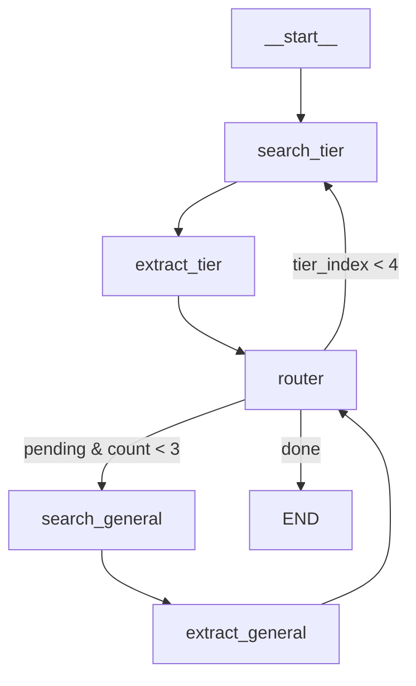

# Gas Agent - Architecture & Algorithm

## Overview

**Gas Agent** fills empty cells in an HMIS (Hazardous Materials Identification System) chemical gas table using:
- **LangGraph**: Stateful workflow orchestration
- **ChatOpenAI (gpt-4o-mini)**: LLM for reasoning and extraction
- **Tavily**: Web search API for retrieving chemical data

---

## Project Structure

```
gas_agent/
├── docs/
│   ├── HMIS TABLE.xlsx          # Input: 197 rows × 47 columns
│   └── HMIS_filled.xlsx         # Output: filled table
│
└── src/gas_agent/
    ├── __init__.py              # Package exports
    ├── main.py                  # CLI entry point
    │
    ├── schema.py                # Pydantic data model (HMISGasRecord)
    ├── loader.py                # Excel → Python objects
    ├── export.py                # Python → Excel
    ├── pipeline.py              # High-level orchestration
    │
    ├── config.py                # Configuration constants
    ├── references.py            # Authoritative domain lists
    ├── prompts.py               # LLM prompts
    ├── utils.py                 # Helper functions
    │
    ├── graph_state.py           # LangGraph state schema
    ├── nodes.py                 # All LangGraph nodes
    ├── graph.py                 # Workflow construction
    └── graph_agent.py           # Main pipeline entry
```

---

## Core Components

### **14 Python Modules** (1,056 lines total)

### 1. Data Schema (`schema.py`)

**HMISGasRecord**: Pydantic model with 47 fields representing chemical properties:
- Identification: `chemical_name`, `cas_number`, `formula`
- Physical: `boiling_point_c`, `vapor_pressure_bar`, `density`
- Safety: `flammability`, `reactivity`, `hazard_class`
- GHS labels: `ghs02_flammable`, `ghs06_toxic`, etc.

```python
class HMISGasRecord(BaseModel):
    chemical_name: Optional[str] = None
    cas_number: Optional[str] = None
    # ... 45 more fields
```

### 2. Authoritative References (`references.py`)

Trusted domain lists for targeted searches:

```python
GAS_SUPPLIERS = [
    "airliquide.com",
    "sigmaaldrich.com",
    "lindeus.com",
    # ... 8 suppliers
]

SAFETY_STANDARDS = [
    "osha.gov",
    "cdc.gov/niosh",
    "nfpa.org",
    # ... 5 standards
]

REGULATORY_BODIES = [
    "epa.gov",
    "echa.europa.eu",
    # ... 4 bodies
]
```

### 3. LangGraph State (`graph_state.py`)

State tracked throughout workflow:

```python
class SearchState(TypedDict):
    record: HMISGasRecord              # Original record
    current_record: HMISGasRecord      # Being updated
    pending_fields: list[str]          # Still empty
    filled_fields: dict[str, dict]     # field → {value, confidence, source_url, tier}
    
    tier: TierName                     # Current tier
    tier_index: int                    # 0-3
    general_search_count: int          # 0-3
    search_results: dict               # Cached search results
    
    config: dict                       # Pipeline config
    llm: Any                           # ChatOpenAI (created once)
    search_tool: Any                   # TavilySearch (created once)
    _next: str                         # Router control
```

---

## Algorithm: 2-Phase Pipeline

### Phase 1: Tiered Domain Search (4 tiers)

**Goal**: Fill fields from authoritative sources

```
For each tier in [suppliers, standards, regulatory, open_web]:
    1. Tavily search with tier-specific domains
    2. LLM batch extraction (all pending fields at once)
    3. Update record with high-confidence values
```

**Tiers**:
1. **Suppliers** (e.g., Air Liquide, Merck) → Physical properties, CAS numbers
2. **Standards** (e.g., OSHA, NFPA) → Safety data, hazard classifications
3. **Regulatory** (e.g., EPA, ECHA) → Regulatory codes, compliance
4. **Open Web** → Fallback, no domain restrictions

**API Calls**: 4 Tavily searches + 4 LLM extractions = 8 calls

### Phase 2: General Search (max 3 searches)

**Goal**: Fill remaining fields with broader searches

```
For up to 3 iterations:
    1. Tavily search with generic query (all remaining fields)
    2. LLM extraction with lower confidence threshold
    3. Mark values as "(review required)"
```

**API Calls**: 3 Tavily searches + 3 LLM extractions = 6 calls

**Total**: ~14 API calls per record

---

## Detailed Workflow

### Step-by-Step Execution

```
START
  ↓
1. SUPPLIERS TIER
   search_tier_node:
     Query: "Argon safety data sheet properties hazards"
     Domains: [airliquide.com, sigmaaldrich.com, ...]
     → 5 search results
   
   extract_fields_node:
     Context: All 5 result snippets (truncated to 1500 chars each)
     Prompt: "Extract: cas_number, boiling_point_c, density, ..."
     LLM Response: {"updates": [
       {"field": "cas_number", "value": "7440-37-1", "confidence": 0.95},
       {"field": "boiling_point_c", "value": "-185.8", "confidence": 0.9},
       ...
     ]}
     → ~8 fields filled
   
   router_node: Continue to next tier
  ↓
2. STANDARDS TIER
   (same structure, different domains)
   → ~4 more fields filled
  ↓
3. REGULATORY TIER
   → ~2 more fields filled
  ↓
4. OPEN WEB TIER
   → ~3 more fields filled
  ↓
5. GENERAL SEARCH #1
   search_general_node:
     Query: "Argon chemical properties vapor pressure viscosity"
     No domain restrictions
   
   extract_general_node:
     Prompt: "MUST provide value for each field, estimate if needed"
     Response includes low-confidence estimates
     → ~10 fields filled (marked "review required")
  ↓
6. GENERAL SEARCH #2
   → ~8 more fields filled
  ↓
7. GENERAL SEARCH #3
   → ~5 more fields filled
  ↓
END
Result: ~40-45 fields filled (out of 45 empty)
```

---

## Key Features

### 1. Confidence-Based Updates

```python
def should_update_field(field, new_confidence, filled_fields, config):
    if field not in filled_fields:
        # Empty field: accept if confidence ≥ 0.3
        return new_confidence >= 0.3
    else:
        # Has value: only update if significantly better
        old_confidence = filled_fields[field]["confidence"]
        return new_confidence >= old_confidence + 0.2
```

### 2. Structured JSON Extraction

**All nodes use same format**:
```json
{
  "updates": [
    {
      "field": "cas_number",
      "value": "7440-37-1",
      "confidence": 0.95,
      "source_url": "https://airliquide.com/..."
    }
  ]
}
```

### 3. Tool Reuse (Performance Optimization)

```python
# Created once in fill_record_with_graph()
llm = ChatOpenAI(model="gpt-4o-mini", temperature=0)
search_tool = TavilySearch(max_results=5)

# Passed via state, reused in all nodes
state = {
    "llm": llm,           # ✅ Reused 7+ times
    "search_tool": search_tool  # ✅ Reused 7+ times
}
```

### 4. Transparency Labels

- **High confidence (0.7-1.0)**: `"7440-37-1"`
- **Low confidence (<0.4)**: `"1.78 (review required)"`
- **General search**: Always marked `"(review required)"`

---

## LangGraph Workflow



**Nodes**:
1. `search_tier_node` - Tavily search with tier domains
2. `extract_fields_node` - LLM batch extraction
3. `search_general_node` - General Tavily search
4. `extract_general_node` - LLM extraction + labels
5. `router_node` - Phase decision logic

---

## Usage

### CLI

```bash
# Process first 5 rows (testing)
uv run gas-agent --dryrun

# Process all 197 rows
uv run gas-agent
```

### Python API

```python
from gas_agent import fill_record_with_graph, HMISGasRecord

record = HMISGasRecord(
    chemical_name='Argon',
    sub_system_filter_formula='Ar'
)

filled_record = fill_record_with_graph(record)
```

### Pipeline Flow

```python
# main.py → pipeline.py → graph_agent.py → graph.py → nodes.py

1. Load Excel → List[HMISGasRecord]
2. For each record:
   - fill_record_with_graph(record)  # Direct call, no wrapper
   - Returns filled record
3. Export → Excel
```

---

## Performance

### Per Record (45 empty fields)

| Phase | API Calls | Fields Filled |
|-------|-----------|---------------|
| Tier searches (4) | 8 | ~17 |
| General searches (3) | 6 | ~23 |
| **Total** | **14** | **~40** |

**Time**: ~15-20 seconds per record  
**Cost**: ~$0.31 per record (Tavily + OpenAI)

### Full Table (197 rows)

- **Total API calls**: ~2,758 (vs. 17,730 in naive per-field approach)
- **Total time**: ~50 minutes
- **Total cost**: ~$62
- **Fill rate**: ~85-90% of fields

---

## Configuration

```python
DEFAULT_CONFIG = {
    "confidence_threshold": 0.3,      # Min confidence to fill
    "overwrite_delta": 0.2,           # Confidence gain to overwrite
    "max_snippet_chars": 1500,        # Max chars per search result
    "max_results_per_search": 5,      # Max Tavily results
    "enable_open_web_fallback": True  # Include open web tier
}
```

---

## Why This Architecture?

### ✅ Efficient
- Batch extraction (all fields at once) vs. per-field searches
- Tool reuse (no recreation overhead)
- 84% fewer API calls vs. naive approach

### ✅ Smart
- Tiered sources (best quality first)
- Confidence-based updates (better data overwrites worse)
- Graceful degradation (general search fallback)

### ✅ Transparent
- Confidence scores tracked
- Source URLs preserved
- Low-confidence values labeled

### ✅ Maintainable
- Modular design (14 focused files)
- Clear separation of concerns
- Direct function calls, no unnecessary wrappers
- Easy to extend or customize

---

## Summary

**Gas Agent** uses a **2-phase LangGraph pipeline** to efficiently fill chemical data tables:

1. **Phase 1**: Search 4 authoritative tiers, fill high-quality data
2. **Phase 2**: General searches for remaining fields, provide estimates

**Key Innovation**: Batch extraction + tiered sources = 84% fewer API calls while maintaining high data quality and transparency.
